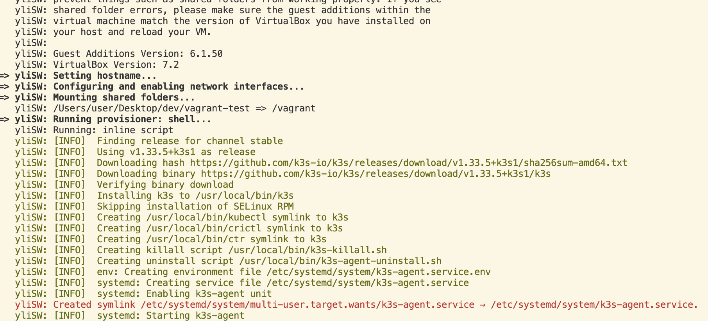
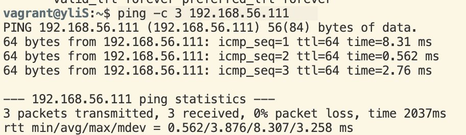
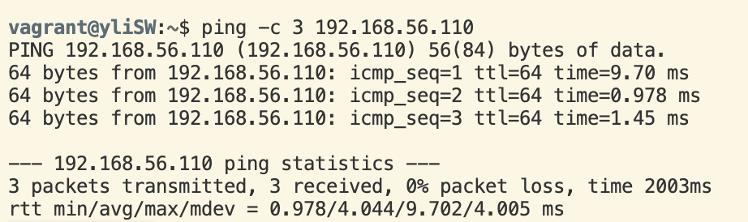

# 🧩 Vagrant K3s Two-Node Setup (Server + Worker)

This guide explains how to bring up a two-node **K3s** cluster using **Vagrant** and **VirtualBox**.
Before running `vagrant up`, it’s best to test step-by-step.

---

## 🧱 Step 1. Start the Server VM

```bash
vagrant up yliS
vagrant ssh yliS
```

Once inside the server:

```bash
sudo cat /var/lib/rancher/k3s/server/node-token
```

Copy this token — the worker will need it later.
Then exit the server:

```bash
exit
```

---

## 🧱 Step 2. Start the Worker VM

```bash
vagrant up yliSW
```

---

## 🧪 Step 3. Network Tests

### 1️⃣ Check network interfaces

Run inside each VM:

```bash
ifconfig -a
```


> Note:
> On Ubuntu 20.04 / 22.04 (focal64) and newer systems,
> interface names are no longer `eth0` / `eth1`,
> but use the **predictable naming convention**, such as:
>
> ```
> enp0s3
> enp0s8
> ```

Typical setup looks like this:

```
enp0s3: inet 10.0.2.15/24        # NAT network (external access)
enp0s8: inet 192.168.56.110/24   # Private network (Vagrant internal)
```

---

### 2️⃣ Test connectivity between nodes

From the **Server** (yliS):

```bash
ping -c 3 192.168.56.111
```

From the **Worker** (yliSW):

```bash
ping -c 3 192.168.56.110
```

If both commands succeed — your network setup is perfect ✅

---

## 🧹 Step 4. Clean Up

When finished, destroy both VMs:

```bash
vagrant destroy -f
```